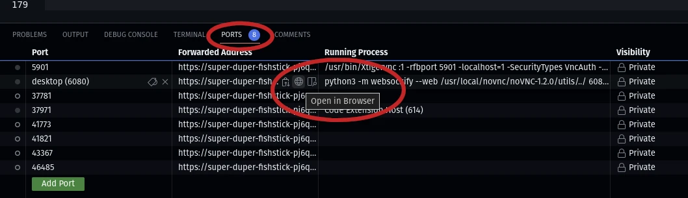

# Knight's Pong

Build your own version of the classic arcade game, Pong.

## Getting Started

Fork this repository. In your own fork, add game logic to `pong.py`. Start your
game by typing `python pong.py` in the terminal.

IMPORTANT: see the next section on graphical output.

## Graphical output and Codespaces

If you were running your game code locally, a window would pop up and display
your game. Getting the graphical output in Codespaces is trickier since the
virtual machine running your code on some faraway server isn't connected to a
display.

But I've added some configuration to this repository that will install some extra
software and send any graphical output to a remote display. If you're curious
about how it works (but only if you're curious), take a look at `.devcontainer/devcontainer.json`.

To see the graphical output of your game in Codespaces, toggle to the "Ports"
tab in the bottom panel, find port 6080, hover over the globe icon, and click
"Open in Browser".



This should open a new tab in your browser. It will ask you for a password; just
hit enter.

You'll see a bare bones desktop. Except for the fact that you're seeing a remote
desktop in your browser (!!), there's nothing very exciting to see.

Now toggle back to the browser tab where you have the Codespaces editor open.
Toggle from the "Ports" tab to the "Terminal" tab and type `python pong.py` at
the command line. It will look like your terminal got stuck, but it's actually
running the pong starter code. Return to the remote desktop browser tab. You
should see a window with a black background. That's how your game will show up!

To stop your game, return to the terminal tab and press `Ctrl+C`.

## `pygames` instead of `turtle`?

The starter code and instructions for this project assume that you'll build Pong
using the `turtle` library. The starter code imports the turtle library:

```python
import turtle
```

You may instead choose to use the `pygame` library.
It's a more advanced library, but it is a little more complicated to use and
you'll have less guidance.

Before deciding to use `pygames`, take a look at the [documentation](https://www.pygame.org/docs/).

## Building the game

Pong has a handful of elements: the screen, the ball, two paddles, and a
scoreboard. Start by building each separately, define their movements and
interactions, and put them together in the main game loop.

### Screen

I've created a "Screen" -- the game window -- for you. In the starter code, see
how I've used constants to define its dimensions and borders. Next spend a
little time trying to understand how I initialized the screen and set its
properties -- creating "turtles" for the ball and paddles will follow a similar pattern.

### Ball

Now that you have a screen, add a ball.

1. First, get a round turtle shape to appear in the center of the screen.
2. Next, get the ball to move. Updating the ball's position will require adding
   some logic to the game loop. (Or, to keep things tidier, you can create a
   function to handle ball movement and call that function from within the game
   loop.)
3. Next, try to get the ball to bounce off the top and bottom of the screen.
   Hint: you'll need to test whether the ball's position is greater than the top
   edge or less than the bottom edge and adjust the ball's direction accordingly.
4. Eventually, you'll want to get the ball to bounce off the paddles, too.
   Before you can code that, you'll need to create the paddles.

### Paddles

Create a left and a right paddle. Pick one to get started. Once you've got it
working, the other will be a breeze.

1. First, get a rectangle to appear on the left or right side of the screen.
2. Next, get the paddle to move. Unlike the ball's movement, which is controlled
   by the game loop, the paddle's movement will be controlled by user inputs.
   Pick a key to move the paddle up and another to move it down. Now add an event
   listener that calls a function which moves the paddle when those keys are
   pressed. (Look at the code that uses the space bar to start the game for an
   example of how to set an event listener.)
3. Now you can write a function that tests for ball-paddle collisions and
   changes the ball's direction accordingly.

### Scoreboard
