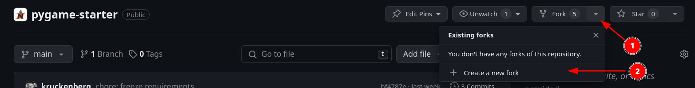
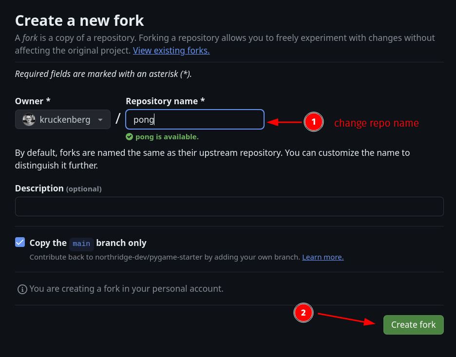

# fork the `pygame-starter` repository

First, a little terminology:

_repository_ (or _repo_ for short): an app or project or other related code
stored in a version control system like GitHub.

_fork_: a copy of a repository that you can modify without changing the original.

---

To get started, _fork_ the [`pygame-starter`](https://github.com/northridge-dev/pygame-starter)
repository. This will create a copy of the repository in your GitHub account.

1. Navigate to the [`pygame-starter` repository](https://github.com/northridge-dev/pygame-starter) and click on the "Fork" button in the upper right hand corner.
   

2. Select your account as the destination for the fork, change the repo name,
   and click "Create".
   

GitHub will start copying the repository to your account. If everything worked,
you'll see your new repo. ✨

[<<](guide_005.md) | [>>](guide_008.md) | [ToC](toc.md)
