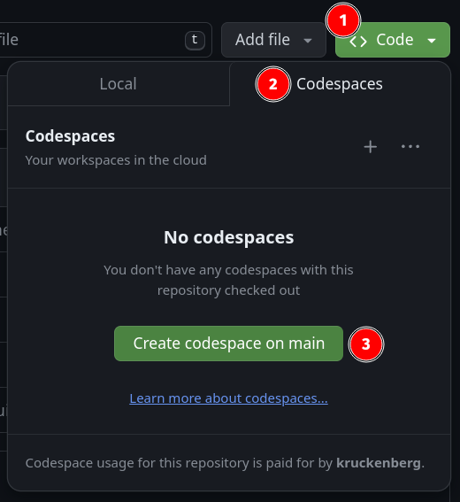

# launch a Codespace

Next, create a Codespace from your newly forked repository.

It will probably take a few minutes to build your Codespace because, in addition
to Python and other software that are normally installed, your Codespace is
getting some extras:

1. the `pygame` library
2. some virtual desktop software we'll need to give your Codespace a graphical
   display

If you're curious about how our Codespace gets configured, peek at the
`.devcontainer.json` and `requirements.txt` files in your repo.
