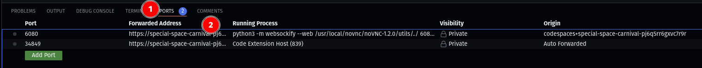
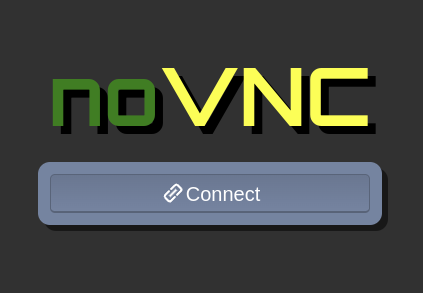
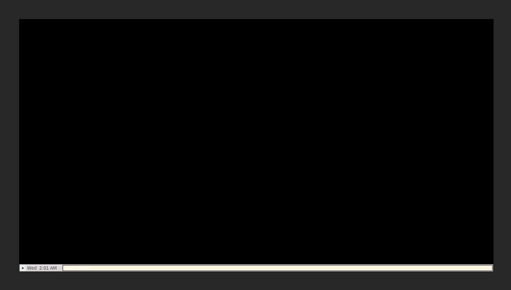

# launching the virtual desktop

Before we can see if our code successfully creates a window, we need to learn
how to access the virtual desktop where it will appear.

In the panel where you usually see the terminal, click on the "Ports" tab. Find
the row that describes port 6080, hover over "Forwarded Address" and click on
the globe icon.

A new browser tab will open. Click the button that says "Connect".

You'll be asked to enter a password. The password is `pass`.

Once you've entered the password, you'll see a desktop that looks like this:

If you don't see the menu bar at the bottom, try scrolling down. We'll want to
see the whole screen without scrolling, so you'll need to adjust the resolution.
Right click anywhere on the desktop, go to the "System Settings" menu, and
select "Set Resolution". A terminal window will open. Type in `1280x720` and hit
enter. Then hit enter again to accept the default DPI setting. Hopefully you'll
now be able to see the entire desktop in your browser tab.

[<<](guide_015.md) | [>>](guide_017.md) | [ToC](toc.md)
