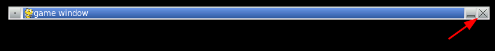

# the `QUIT` event

Try running your code again, but this time, instead of triggering as many events
as you can, let's see what event is printed when you try to close the window by
clicking the "X" button in the window's title bar.



Clicking the "X" button sends a `QUIT` event to the event queue. When printed to
the terminal, it looks like this: `<Event(256-Quit {})>`. But it doesn't _do_
anything. The window stays open.

Let's change that. As we inspect each element, we can test if it is a `QUIT`
event. Let's remove the lines that print the events are replace them with the
following:

```python
while count < 300:
  clock.tick(60)
  for event in pygame.event.get():
    if event.type == pygame.QUIT:
      print("QUIT event detected")
  count += 1
```

**Be sure to keep the `count += 1` line at the same level of indentation as the
`for` loop.** If you don't, the `while` loop will run forever.

Each `event` object has a `type` attribute that we can test. `pygame.QUIT` is a
constant that will be equal to the `QUIT` event type. So our new `if`
conditional will be true when (but only when) we're inspecting a `QUIT` event.

Try it. You won't see all those mouse movement events this time, but you should
see one `QUIT event detected` line for every time you click the "X" button.

[<<](guide_021.md) | [>>](guide_023.md) | [ToC](toc.md)
